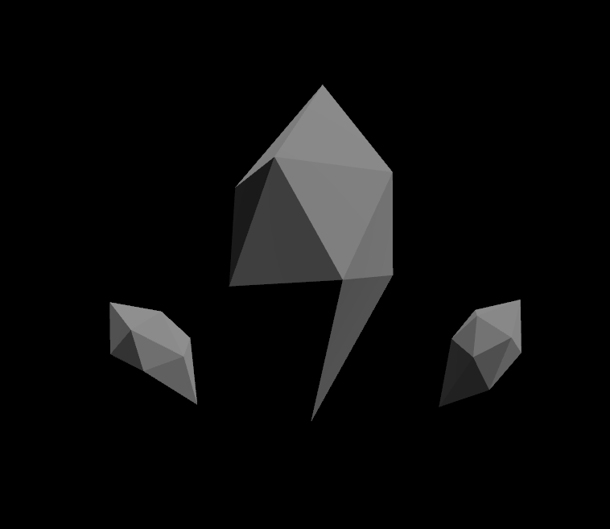
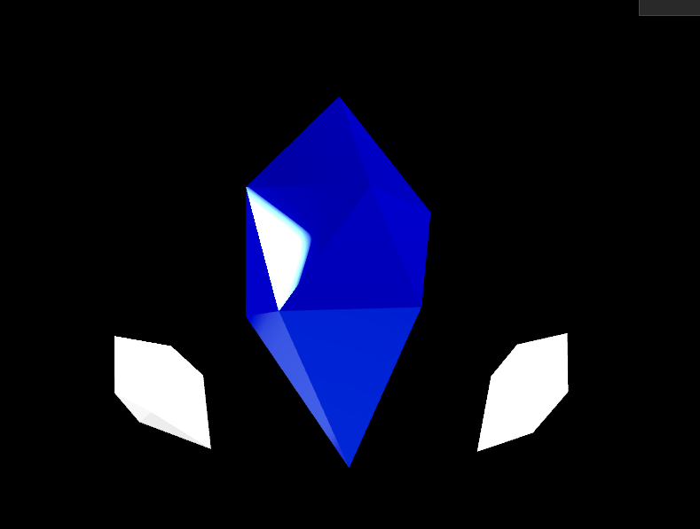
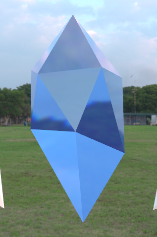
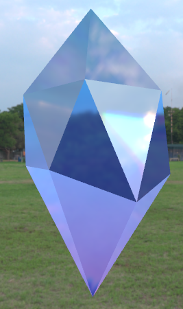
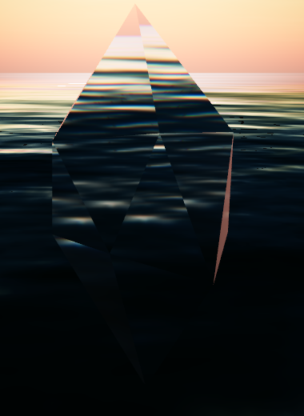

# threejs-webgpu-model-study

Three.js WebGPU を使って、3Dモデルをきれいに表示するための学習リポジトリ。

## 目標

Blenderで作成した3Dモデルを WebGPU レンダラーでできる限りきれいに表示できるようになる。

## 学習トピック

### WebGPURenderer
- [x] WebGPURenderer の基本的な使い方
- [x] WebGLRenderer との違い

### GLTFLoader
- [x] GLBファイルの読み込み
- [x] シーンへの追加

### マテリアル
- [x] MeshStandardMaterial
- [ ] MeshBasicMaterial
- [ ] ベイクしたテクスチャの表示
- [x] MeshPhysicalMaterial
- [x] TSL グラデーション

### ライティング
- [x] AmbientLight
- [x] DirectionalLight
- [ ] PointLight / SpotLight

### シャドウ
- [ ] シャドウの設定
- [ ] シャドウの種類と品質

### OrbitControls
- [ ] 基本的な操作
- [ ] damping の設定

## メモ

### WebGPURenderer

`three/webgpu` からインポートして使う。WebGLRenderer との最大の違いは **初期化が非同期である**こと。
`await renderer.init()` を呼ばないと、GPU の準備が整う前にレンダリングが始まってしまう。
そのため、セットアップ処理全体を `async function` で包む必要がある。
```js
async function init() {
  const renderer = new THREE.WebGPURenderer({ antialias: true });
  await renderer.init(); // GPU初期化を待つ
  renderer.setSize(window.innerWidth, window.innerHeight);
  document.body.appendChild(renderer.domElement); // canvasをbodyに追加
}
init();
```

**`renderer.domElement` について**
Three.js のレンダラーは内部で `<canvas>` 要素を自動生成する。
`renderer.domElement` はその canvas への参照で、`appendChild` で HTML の body に追加することで画面に表示される。

**リサイズ対応について**
ウィンドウサイズが変わったとき、カメラと canvas の両方を更新する必要がある。
```js
window.addEventListener('resize', () => {
  camera.aspect = window.innerWidth / window.innerHeight; // アスペクト比を更新
  camera.updateProjectionMatrix();                        // 内部計算を作り直す（必須）
  renderer.setSize(window.innerWidth, window.innerHeight); // canvasサイズを更新
});
```

`camera.aspect` を変えただけでは反映されない。必ず `updateProjectionMatrix()` とセットで呼ぶ。

### PerspectiveCamera
```js
new THREE.PerspectiveCamera(fov, aspect, near, far)
```

| 引数 | 意味 | 今回の値 |
|------|------|----------|
| fov | 縦方向の視野角（度） | `60` |
| aspect | アスペクト比（横÷縦） | `window.innerWidth / window.innerHeight` |
| near | これより近いものは描画しない | `0.1` |
| far | これより遠いものは描画しない | `100` |

near と far で描画範囲を絞ることで GPU の負荷を抑えられる。
広いシーン（湖など）では `far` の値を大きくする必要がある。

### GLTFLoader

`three/examples/jsm/loaders/GLTFLoader.js` からインポートして使う。
```js
import { GLTFLoader } from 'three/examples/jsm/loaders/GLTFLoader.js';

const loader = new GLTFLoader();
const gltf = await loader.loadAsync('/models/your-model.glb');
scene.add(gltf.scene);
```

**`loadAsync` が非同期な理由**
GLB ファイルはサイズが大きいため、読み込み完了を待たずに次の処理が走ると
モデルが存在しない状態でレンダリングが始まってしまう。
`await` で読み込み完了を待つことで確実にモデルが表示される。

**`gltf` と `gltf.scene` の違い**
`loadAsync()` が返す `gltf` はデータオブジェクトであり、3Dオブジェクトではない。
回転・移動などの操作や `scene.add()` には `gltf.scene` を使う。

| プロパティ | 内容 |
|---|---|
| `gltf.scene` | モデル全体のルートオブジェクト |
| `gltf.animations` | アニメーションデータ |
| `gltf.cameras` | カメラデータ |

**モデルの操作（position / scale / rotation）**
`gltf.scene` に対して position・scale・rotation を使って操作できる。
```js
// 位置
gltf.scene.position.set(0, -1, 0);

// 大きさ（set() で呼ぶ、= で代入しない）
gltf.scene.scale.set(0.2, 0.2, 0.2);

// 傾き（単位はラジアン）
gltf.scene.rotation.z = -0.5;

// 度数で指定したい場合
gltf.scene.rotation.z = -30 * (Math.PI / 180);
```

`scale` や `rotation` は Vector3 オブジェクトなので `= 0.2` のように直接代入できない。
必ず `scale.set()` か `scale.x = 0.2` のように使う。


### マテリアル

**MeshStandardMaterial の主要プロパティ**
物理ベースレンダリング（PBR）に基づいたマテリアル。ライトの影響を受けるリアルな表現ができる。

| プロパティ | 意味 | 値の範囲 |
|---|---|---|
| `color` | 基本の色 | 16進数カラー |
| `roughness` | 表面の粗さ | 0（ツルツル）〜 1（ザラザラ） |
| `metalness` | 金属っぽさ | 0（非金属）〜 1（金属） |
| `transparent` | 透明を有効にするフラグ | true / false |
| `opacity` | 透明度 | 0（透明）〜 1（不透明） |
| `emissive` | 自発光の色 | 16進数カラー |
| `emissiveIntensity` | 自発光の強さ | 0〜 |

`transparent: true` にしないと `opacity` が効かない。必ずセットで使う。

**traverse で全メッシュにマテリアルを適用**
`gltf.scene` の中に複数のメッシュがある場合、`traverse` で全部巡回して適用する。
```js
gltf.scene.traverse((child) => {
    if (child.isMesh) {
        child.material = crystalMaterial;
    }
});
```

**環境マップ（RoomEnvironment）の追加**
`MeshStandardMaterial` は周囲の環境を反射する。環境マップがないと反射する対象がなく安っぽく見える。
`RoomEnvironment` を使うと手軽に環境反射を追加できる。
```js
import { RoomEnvironment } from 'three/examples/jsm/environments/RoomEnvironment.js';

// scene の定義より後に書く
const environment = new RoomEnvironment();
const pmremGenerator = new THREE.PMREMGenerator(renderer);
scene.environment = pmremGenerator.fromScene(environment).texture;
pmremGenerator.dispose();
```


**MeshPhysicalMaterial（ガラス・クリスタル表現）**
`MeshStandardMaterial` の上位版。ガラス・水・宝石のような表現に特化したプロパティが追加されている。
`transmission` を使うと光が素材を本当に通り抜けるような表現になる。

| プロパティ | 意味 | 値の範囲 |
|---|---|---|
| `transmission` | 光の透過（ガラスっぽさ） | 0〜1 |
| `thickness` | 素材の厚み | 0〜 |
| `ior` | 屈折率 | 1〜2.5（ガラス1.5 / ダイヤ2.4） |
| `dispersion` | 光の分散（プリズム効果） | 0〜 |

`transmission` を使うときは `metalness` を `0` にする。金属は光を透過しないので両方上げると物理的におかしくなる。
```js
const crystalMaterial = new THREE.MeshPhysicalMaterial({
    color: 0x88ccff,
    roughness: 0.0,
    metalness: 0.0,
    transmission: 1.0,
    thickness: 1.0,
    ior: 2.4,
    dispersion: 1.0,
    emissive: 0x2244ff,
    emissiveIntensity: 0.2,
});
```

**HDR背景の設定（HDRLoader）**
HDR画像を背景と環境マップの両方に設定することで、クリスタルがHDRの景色を反射・屈折するようになる。
HDR素材は [Poly Haven](https://polyhaven.com/hdris) で無料入手できる。
```js
import { HDRLoader } from 'three/examples/jsm/Addons.js';

const hdrLoader = new HDRLoader();
const hdrTexture = await hdrLoader.loadAsync('/your-file.hdr');
hdrTexture.mapping = THREE.EquirectangularReflectionMapping; // 全天球画像として正しく展開
scene.background = hdrTexture;   // 背景として表示
scene.environment = hdrTexture;  // 反射・屈折の対象にもなる
```

`scene.background` と `scene.environment` の両方に設定するのが重要。片方だけだとクリスタルが綺麗に見えない。


**TSL（Three.js Shading Language）でグラデーション**
TSL は WebGPU 時代の Three.js 専用シェーダー記法。従来の GLSL と違い、JavaScript の中に直接書ける。
```js
import { mix, color, positionLocal } from 'three/tsl';
```

| 関数・変数 | 意味 |
|---|---|
| `color()` | 色を定義する |
| `positionLocal` | 頂点のローカル座標 |
| `mix(a, b, t)` | a と b を t（0〜1）で補間する。0なら a、1なら b |

**colorNode について**
`MeshPhysicalMaterial` の `color` プロパティは単色しか設定できない。
グラデーションなど動的な色を設定するには `colorNode` にTSLノードを渡す。
```js
crystalMaterial.colorNode = gradientColor;
```

**Y座標の正規化**
`mix` の3つ目の引数は 0〜1 の範囲である必要がある。
モデルのY座標は -1〜1 など様々なので、0〜1 に正規化してから渡す。
```js
const gradientColor = mix(bottomColor, topColor, positionLocal.y.add(1).div(2));

// positionLocal.y      → Y座標（例：-1〜1）
// .add(1)              → +1 して 0〜2 にする
// .div(2)              → ÷2 して 0〜1 にする
```


### ライティング

**toneMapping について**
リアルな明暗表現のために設定する。`ACESFilmicToneMapping` が映画的な色調で自然に見える。
```js
renderer.toneMapping = THREE.ACESFilmicToneMapping
renderer.toneMappingExposure = 0.5  // 明るさ（1.0が基準）
```

**DirectionalLight と太陽の同期**
`DirectionalLight` の position を `sun` と同じ方向に設定することで、空の太陽と光の方向が一致する。
`multiplyScalar(100)` で太陽の方向ベクトルを遠くに配置している。
```js
const dirLight = new THREE.DirectionalLight(0xffffff, 2.0)
scene.add(dirLight)

// updateSun() の中で同期
dirLight.position.copy(sun).multiplyScalar(100)
```

**updateSun の仕組み**
太陽の位置・空・水面・ライト・環境マップを一括で更新する関数。
`renderer.init().then()` の中で呼ぶことで WebGPU 初期化後に実行される。
```js
function updateSun() {
    const phi = THREE.MathUtils.degToRad(90 - 2)  // 太陽の高さ（小さいほど地平線に近い）
    const theta = THREE.MathUtils.degToRad(180)    // 太陽の水平角度

    sun.setFromSphericalCoords(1, phi, theta)

    sky.sunPosition.value.copy(sun)               // 空に反映
    water.sunDirection.value.copy(sun).normalize() // 水面に反映
    dirLight.position.copy(sun).multiplyScalar(100) // ライトに反映

    sceneEnv.add(sky)
    renderTarget = pmremGenerator.fromScene(sceneEnv)
    scene.environment = renderTarget.texture       // 環境マップに反映
}
```

**SkyMesh の設定パラメータ**

| パラメータ | 意味 |
|---|---|
| `turbidity` | 大気の濁り・霞（2〜20が自然） |
| `rayleigh` | 空の青さ・夕焼けの赤み |
| `mieCoefficient` | 太陽周りの光の広がり |
| `mieDirectionalG` | 太陽の光の集中度（0〜1） |

夕焼けにするには `elevation` を低く（2°前後）、`rayleigh` を高く（3〜4）するとよい。

**WaterMesh の設定**
WebGPU 専用の水面シェーダー。`waternormals.jpg` が必要（Three.js の GitHub から入手）。
```js
const water = new WaterMesh(waterGeometry, {
    waterNormals: waterNormals,   // 波の法線マップ
    sunDirection: new THREE.Vector3(),
    sunColor: 0xffffff,
    waterColor: 0x001e0f,         // 水の色
    distortionScale: 3.7,         // 波の大きさ
})
water.time = 0  // 必ず初期化する（しないと NaN になる）

// アニメーションループで更新
water.time += 0.1 / 60.0  // 数値を大きくすると波が速くなる
```



### シャドウ


### OrbitControls